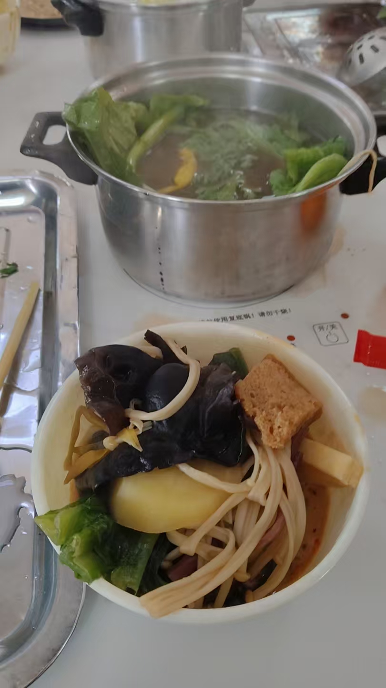

#### 鸡血汤
最近我刷了这个什么流星花园，这个剧在小学和初中都是爆火的剧，可惜那时候我不看，现在想想，想不到现在偶像剧的许多东西，都是照搬他的，这个剧情很像现在的短剧，豪门，打压，跌宕起伏，这个剧如果我第一次看，绝对会吸引住，但是我不是第一次看这种套路了，越看越乏味，但是真的好看，导致现在的许多女生心里，都是受这个影响，我看我姐某个朋友跟杉菜一模一样，不过仅仅是脾气一样，语气也很像，现在回看这个剧，算是弥补了童年的空白。
今天喝的鸡血汤加酥肉（万达那个店），味正，雷子请的，人很多，我以为是苍蝇馆。
#### 2025上班第一天
今天（2.8）中午喝了一碗驴汤烩面和宗，我愿称之为没味，而且采取了叫号取餐，跟医院叫号一模一样，那个声音就是照搬了，地道，怪不得难吃，谁有病谁吃，之后又去了好想来零食店，今天88折赚了，一兜才26？有法式奶香片，味道很好，还买了一罐水果罐头，味道应该也行。
今天，再见小猫（本来我就是替别人养几天），这个猫啊，可会享受，可像人，让我一度感觉她就是一个人，爱吃肉，爱喝甜，跟小孩的饮食习惯一模一样，喜欢睡到床上，睡到枕头上，卧着，有时候甚至打呼噜，这个给我惊呆了，猫居然也打呼噜，最爱吃肉，跟女生一样，爱干净 经常舔自己的毛，让自己更干净，跟个主人一样睡在我了床上，还知道敲门，挠门，还学会了开门，能。
#### 初九
今天早上去了我奶家，早上吃了一个酸菜包子，味正，辣，感觉还不错，这几天算命是越来越准了，收到了很多反馈，但是已无当初的兴奋，本来就是大师，应验就是正常。感谢伟大的易经，让我明白这世界的真相，不必向其他生命那般，今天强儿又回来了，前几天才办的送别仪式，不到十天又回来了，本想请他吃小火锅，但是俺爹做饭给他了，今天我发现俺家猫睡觉打呼噜，跟人一样。
#### 憨火锅（2.6）
憨火锅味道真的很不错，上次修路我没看见，这次跟我姐又去那个憨火锅了，年轻人很多，生意很好，人很多，一位大约是26，不限量，随便吃，今天吃的是那家的寿喜锅，味道很正，想不到寿喜这么好吃，咸鲜味的，口味独特，口味醇厚而不腻，再搭配上蔬菜，吃起来很养胃，好吃，就是人很多，中午一点了还有人来。俺姐给我买了一个幸运咖的葡萄奶盖饮料，一喝就是劣质添加剂怼出来的，添加剂味很重。
昨天晚上我的猫疯了，因为昨天猫罐头吃完了，再加上她凑到我跟，我又逗逗她，她生气了，上窜下跳，跑了超快，半夜又点外卖送的猫粮，真难伺候啊，我记得买的猫粮明明不一样，发来的三罐一模一样，醉。吃完了猫罐头，心情又好了，非得睡我身上，赶紧给这个祖宗送回去吧。

#### 躲春
大s在该“躲春”，这一天逝世，大s属"蛇"(后得知她属龙，但她名叫大s，其中s其形像蛇，发音和巳谐音，巳蛇，故也以本命年论)，今年本命年，本该老老实实穿红躲春，非得出来玩，今天躲躲春，好，要是不知天威出来玩，那真是，有点自讨苦吃了。今天我给我了逆子（猫）买了一些罐头，买了一包鲜丰的鲜肉条（上次），还有今天买的燃鲸购超市买的，两瓶金枪鱼罐头，一包猫条，还有一根猫条，吃的是真好，今天我还是出来了，中午领外卖的时候，今天是没有完全躲春，但是还是算躲了。
#### 初三

祭祀是我们这初三的习惯，都会去给过世的人烧纸，也会和难得见面的亲人聚一次，那天晚上先做了一个梦，这个梦是我在上一节户外课，老师居然在教怎么念咒控制什么亡灵，然后又一个同学念错了，老师生气的说，念错了会发生可怕的事情，然后赶紧纠正了，然后其中有一个我的二货朋友，也加入其中了，然后我远远看着，赶紧跑了，结果那货不知是故意犯贱还是怎样，跑向我跟，嘴里不停的念咒，我吓醒了。

导致我第二天去的时候，心里有点毛，其实那天也没有发生什么事情，那天还是很有意境的，天上下了很小的雪，然后烧纸的灰也在天上飘着，有一种强大的宿命感，好像老天垂泪。

我们俩家很巧，在墓地一块到了，大家都在烧纸，俺爹很虔诚，其他人都不是很在意了，我向来如此，不喜欢在意太多事情。

程程很兴奋，指着死去的人问是什么亲戚。

之后去了金明池那条街上的禾源那家店，点了很多菜，有一个培面鲤鱼，还有一个孜然羊肉（微辣，我感觉很好吃，其他人怕辣没有吃），小笼包（味道很正，感觉很好吃），荤三素一，炸鸡和炸虾片，米酒，散子加苦苣，最后还有一个柠檬酱加糍粑。

其他菜感觉都是预支菜，因为那个汤端上来就是凉的，说明提前做好的。

程程很有特点，可能是玩抖音玩多了，感觉自己是导游，喜欢拍视频解说，说这是什么什么，非常活跃，爱说话，喜欢成为中心。但是人很燥。

俺家人喜欢溺爱孩子，程程也是，对孩子很大方，饭后还买了一些蛋糕，都是巧克力，还有什么马卡龙？

然后就回家都走了，带走了很多扣碗。

#### 初四

也就是今天（2.1），今天跟着我姐去了姐夫家的很多亲戚，我发现城市太小了，这么远的亲戚居然之前也是熟人，同学。去他们家吃了一个绿豆条，还有一个广式糕点，带肉的饼干？味道真是一言难尽。

我姐带我去了星光天地。去吃了那个红云烤肉，那家装修一般，但是味道很惊艳，缺点是那个什么筷子头光掉，他家的味道特别惊艳，感觉食材很新鲜，人很多，座无虚席，那个孜然芝麻真是秘制的酱料，特别的香，还有他家的西瓜汁和柠檬汁，都是水果鲜榨的，里面还能找到打碎的籽，味道非常新鲜，还有那个芝士玉米，也是现烤的，不得不说，现做的东西，就是美味，味道就是正，比昨天的预支菜强！

不足之处就是吃之前吃了一些买的俄罗斯红肠，提前吃饱了，导致吃正餐不多。辣椒面只辣不香。

之后去了奶茶店碰见了洋洋，不得不说，洋洋穿着奶茶的工作服，感觉滑稽，不过聊的还是很开心，我也是机缘巧合找到他了，刚好碰见一个人（应该是我姐夫的熟人），然后他在奶茶店工作，我问有没有白这个人（他之前说过），他说有，然后就找到他了。

洋洋看着这个工作还是满意的，虽然外人看来本科去做奶茶还是屈才了。

最后还是被送了三杯奶茶，虽然不是洋洋送的，那个咖啡太苦了，什么生椰拿铁。现在也没有喝完。

明天初五，迎财神。
#### 初二
今年是大年初二，今年去了我姥姥家，我本以为有什么刁难的话，说什么我该结婚了？还是收入？结果都没有，没有令我难堪（但是非让我磕头，给俺姥拜年，但是我也照做了，收二百元。期间得知樊姐怀孕，她真的很瘦，但是现在审美好看，属于白幼瘦，看着营养不良，当然，以我的水平，早已看出肚中孩子的未来），期间只问了一个问题，我在哪上班？我说给公司上班，可能他没有想到我这么回答，压根都没有想到我会这么回复，一下子就不知道怎么回复了，可能脑子里光想怎么怼我了，这一句一下子问懵了。所以就没有后话了，期间吃了一些常见菜，互相说着今年不赚钱之类的话，期间有一个麻辣鸭头很招人喜欢，因为辣，但是我吃了，不辣，可能因为我能吃辣了，这点辣已经满足不了我了（这个饭是二舅的小女儿做的，在她家，显得很懂事）。
后来去了鲜丰，鲜丰被誉为开封的胖东来，里面有确实有很多胖东来的仿品，也可能是直接从那进货的，但是东西太贵了，一些东西没有狠下心去买。
今年是本命年，本命年会给你一种宿命感，本命年，就是本就是命，这就是命，这种巨大的宿命感，我已经感觉到了，本命年不是说什么属相，这是表面，真正的是宿命，给人生轨迹做出一个大致的轮廓。
#### 蛇年

最近我朋友给我发来了一组照片，是2024元旦的事情，我已经忘的差不多了，我回看我之前写的东西。

我能看出来，我之前想把网站做一个时评网站，但是后来倾向于一个个人日记，这是有意义的，这会告诉我，我活着的证明，记录，意义。

我现在回忆一下那件事，我和洋一块去了学校后院，我们很喜欢去学校后院，找找偷跑出来学校的路或者看看那些荒草总是给人一种寂静，安静。

那天我和洋出来，正好碰见一个外卖员，送外卖，问路，但是那里都是荒草，走进这片荒野中送外卖，我和洋都笑了 

后来那个男的又打了很多电话，先是后边，怕被学校抓，然后是前门，又不怕了。

我和洋还去了一次体育馆，那个开封新开的体育馆，很大，但是没人，空旷至极 路边都是散落的炮，都是烟花，加特林，看来是玩爽了。

我和洋身上发生了很多事情。

洋很聪明，但是不自信，胆小怕事，想的很多。

今天大年初一，什么也没做，前天去了豪家，那货感冒了，发烧，那天他家吵架了，而且说话很难听，我发现吵架是有意恶心对面，这就是说话的艺术，故意让家人恶心，说重话，庆豪妈想去娘家，他爹说明早必须回来，不回来试试，你敢，他妈知道我给跟了，不想说太难听丢人，故意忍让，据说上午吵架更凶，然后庆豪感觉面子上挂不住，说我今天不该去他家，我感觉也好，自己管不住自己情绪，怨不得别人。

除夕那天我哥和我嫂来了，俺爹妈很紧张，恐招待不周，但是我明白他家，不会吃俺家的饭菜，但是我知道她喜欢柯南，买了一些柯南的钥匙链，给她了，不知道扔没有，反正当时是没扔。他妞惯的太娇了，太娇了，那天晚上一直放炮，零点直接给我振醒，不要说我为什么没有睡死，我不是真死，炸弹炸了还是要醒的。

还有是把他家的猫给我了，伺候那个猫真是伺候爷，我感觉那个猫懂人语，很聪明，会围着人腿转圈讨饭，聪明的很，那天我起了一卦，我跟那个破猫有缘。

今天天气显示，开封龙亭是重度污染，看来这个空气检测，还是真的，因为一直放炮，今天太懒了，按理说不该懒，但是无事做嘛。

今天虽是本命年，但我感觉运气还行。
