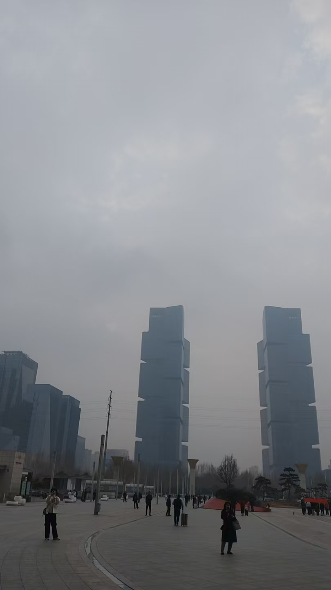

#### 郑州之旅

星期六晚上，我从宋城路站出发去郑州，去的时候我爹送我的，路口的时候看见一个小孩在哭不停，再后来走了一个小路，有一条浅河，当时触景起卦，到了车站。我好久没有坐高铁了，还是去了，刚去的时候，看见了很多人开始奔跑，我下意识的感觉是车快开了，但是我没有急，因为我也没有买票，还能等等，先是碰见了一个老人，这个老人不会操作机器，然后我帮了他，本想和他再聊几句，老人留下谢谢就走了，之后我上了车，看见了很多开封的女孩，我感觉他们都很会化妆，坐高铁这一幕很熟悉，因为我在上海也经常坐，所以我想看看区别，结果是，开封人似乎更注重形象。化妆更漂亮，也可能是我侥幸碰见了大学生多一些。

那天天气不好，有一层雾气，然后到了车站，我对郑州地铁的感觉是，不怎么检查，但是上海检查的有点严格，也很认真，他们眼里，似乎多了一些悠闲自然，但是上海人的眼里 闪着对功名利禄的追逐。
换句话说，充满了心机。
下车之后本想找朋友玩，他没有来接我，我还是自己去了，那个价位租的屋子，十有八是串串屋，但是那个房子装修很有意思，虽然是假的贴皮木地板，但是里面有一股很浓的香水味，很好闻，那天晚上本想吃鸭架 结果真的侥幸碰见了一个卖鸭架的摊，价钱不贵，而且卖的很有意思，很注重外表，故意没有把菜切碎，而是很大的一块块，很有卖相。那个鸭架做的也很有意思，上边有很多芝麻和辣椒，显得很好看。是个夫妻摊，从他们自己嘴里说，他们好像是开封县的人，那个女的很爱说话，也很细心，但是人老了，脸上皱纹不少，这种女生就是那种热爱生活的女生，希望她能赚钱吧。
后来又买了一个什么黄金甘蔗，就是黄皮的甘蔗，反正有点贵，一根三十多。
后来买了最后的三个饼，一块钱一个。
又买了一些酒，就是晚宴，那个酒好像中了再来一瓶，不过我好像又丢了 
我回去的时候，看见了很多穿着妖娆的女生，打扮的很妖娆 
由于楼房高，能欣赏到夜景，夜里雾霾很重，天发着红光，怎么到了夜里十二点，还是暗不下来，根黄昏似的。
还下了雨 有一种末日的既视感。
我怎么也睡不下来，睡不着 放在之前，很快的睡着了。
可能是旁边那位数字键盘声音太好了。
到了二点多睡着了，醒来已是八点半，给老板请假后又睡到了十一点多，由于天气很差，也没有出来玩，点了一个烤肉饭，故事到这有很有趣了，我朋友请我的烤肉饭，按理说俩份一样 但是他那个多了一个鸡蛋和肠，我那个吃着很好吃，他那个跟我是一样的，好像多加了一个什么酱油，特别的咸，根本吃不下。这件事就很有趣。
到了下午，睡了一会，然后返回了开封。坐地铁很有意思，先会尖叫一声，提示车来了，那
有一种探秘地下世界的感觉。
来的时候，不是回去的时候，坐高铁候车的时候 有一种投胎的感觉，大家都很急着坐车，老老少少都有，都在那等着，等着自己的车和路线，真的很像去投胎的那种感觉。

这次去郑州的感觉，还是有一点震撼和惊喜的。

附照片，下图夜景约为夜里十二点。（那个小区是个老楼，没灯亮，很像恐怖小说的取景地）

