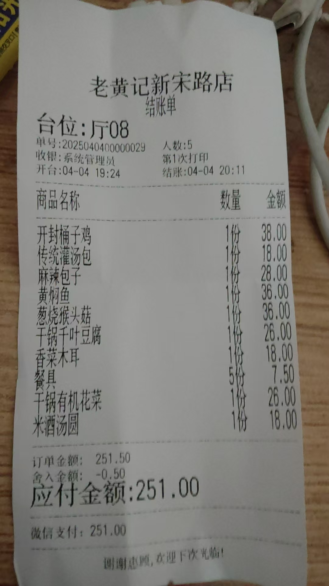
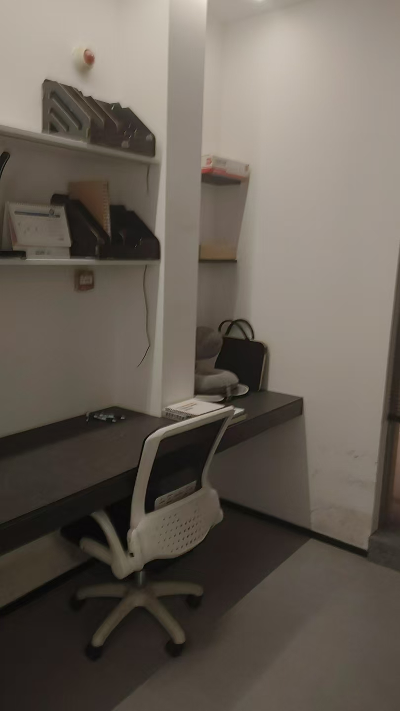
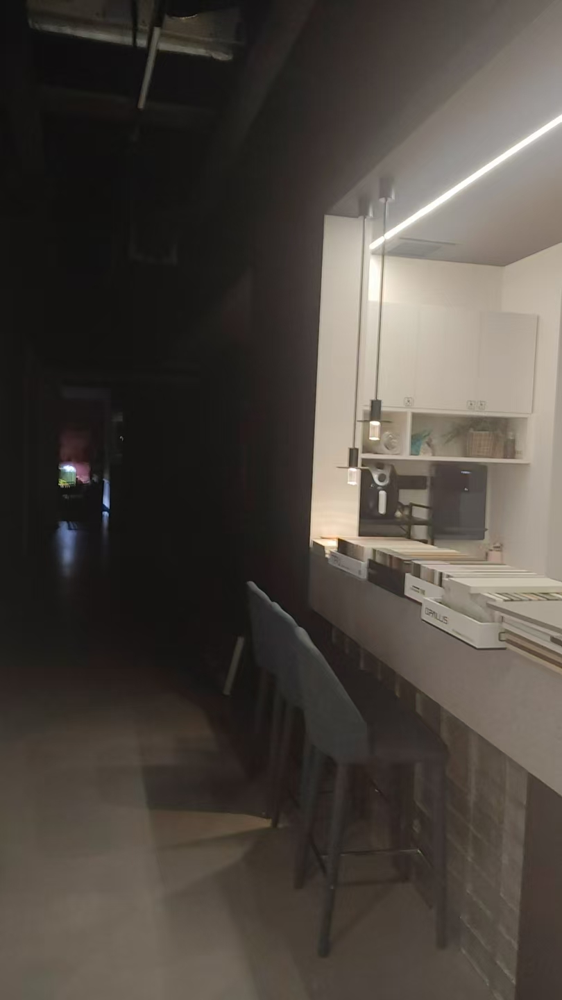
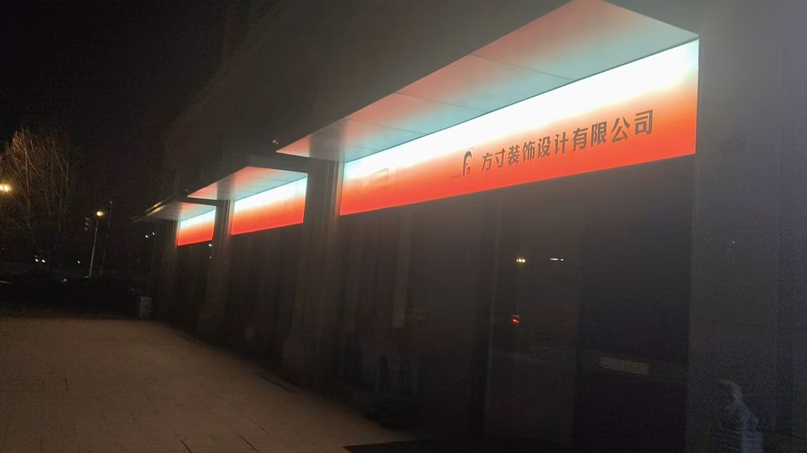
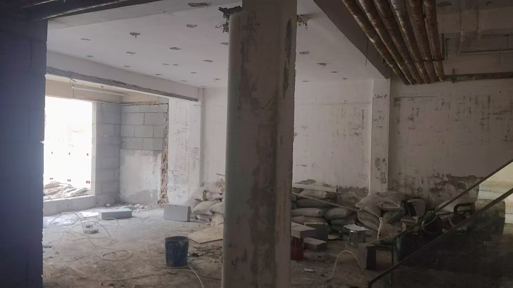
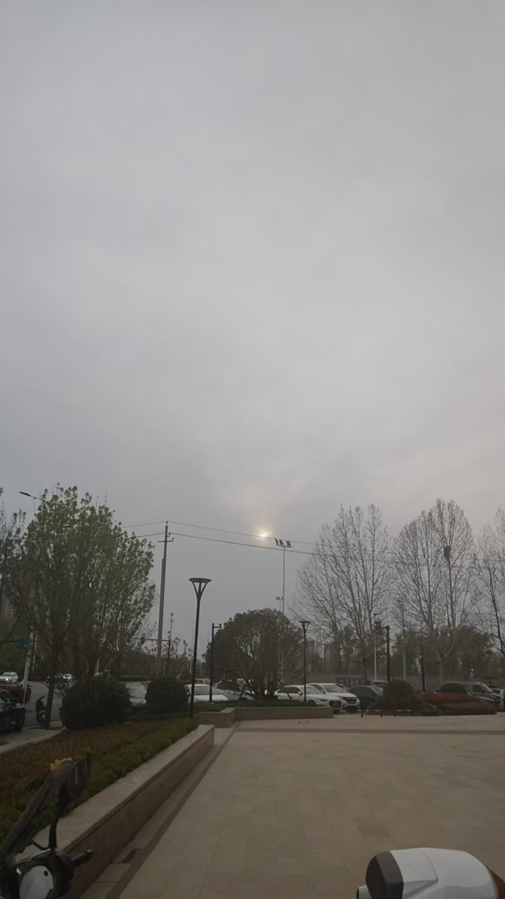
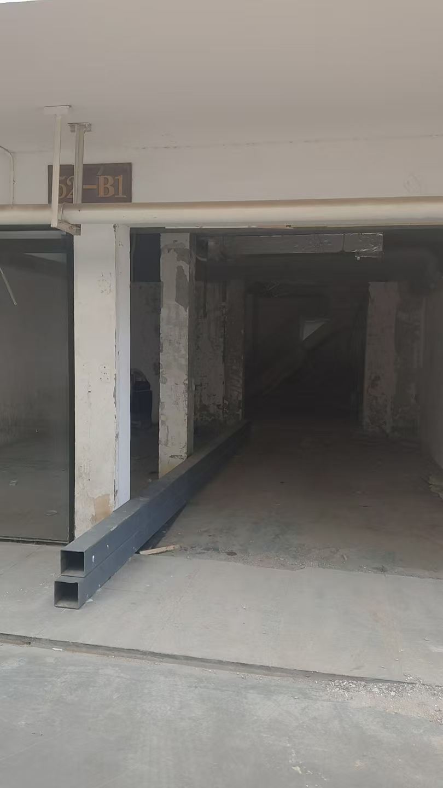
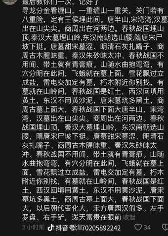

#### 在家的一天
老板不让干，说实话我心里很复杂，有时开心，有时又感觉难过，这是复杂的，令我的心情波澜了很久，但是我都战胜他们了，看破他们了。一切都有终结的时刻，什么时候都行，也无意义。
#### 记清明
昨天（清明节）晚上早走了一会，去我姐家吃饭，谁知那天田战友来了，带了一个女友，看着老，个高，很节俭，我以为穷，但是是个律师，去了一家饭店吃饭，菜单如下 

我那天晚上很想吃黄焖鱼，汤是酸辣的，我之前在小宋城吃过，俺爹给我买的，说很好吃，但是我不管是看着，还是听这个名字，都感觉不是很好吃。
结果味道很惊艳，过了很久忘了，现在再吃。
味道也很惊艳，我还是很喜欢。
就是刺没有彻底炸酥，直接吃还是有点扎嘴。
想不到那天还是这么有口福，第二天周六歇班。
下面是周六（清明节是周五）的事情：
上午补睡了一觉，中午老板给我说不用干了，当时有点痛苦，在买烧鸡的路上，知道这个消息，当时也发生了一些事情，就是本想买崔家斗鸡，结果走过了，没有买到，又找了再买到 
还买了一个烧饼，看样子是红薯味的，买了四个不同口味的黄桥烧饼，但是吧，这个饭是给姐买的，我刚吃一包泡面，再加上昨天吃多，收到这个消息，就没有再吃饭。
然后无聊打王者，结果出奇的居然连胜了几把，然后俺姐想叫我去姥姥家，我想睡觉没有再去，其实没有睡着，然后到了晚上，外出，一路上 心情都很放松愉快，顺便帮俺爹送货 ，再送给俺奶一个板凳，然后就到公司去收拾行李，准备离开公司，那天公司放假，我以为没人，但是意外看见了俺嫂一家，李阳和他老婆儿子都在，聊了很多，其实我去的路上都很开心，因为当我真的准备离开的时候，巨大的解脱感已经上来了。然后又去俺奶家吃饭，俺奶给我做了一个牛肉和饼，我真的很开心 ，那种解脱感。
一路上 ，心情都很放松愉快，但是有一个小u盘忘拿了，又回去拿了。
另外，拿U盘的路上，我还拍了几张照片留念，其中那张天空的照片，拍摄日期是清明节的前一天，我本想拍上孙某人，但是他很快走了，这也许是我们的最后一面，但是无所谓，因为早已经梦幻泡影。其中那几张废墟一样的照片，是破坏后老公司的样子，剩下的那几张照片，分别是我的现在的新公司，还有我的工位，还有很多感想，想记，日后有空可能记下。

