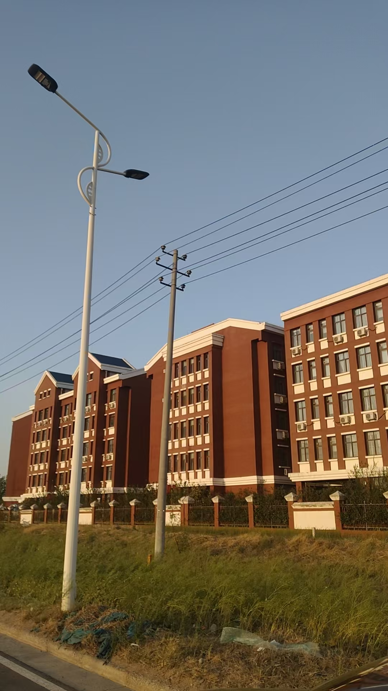
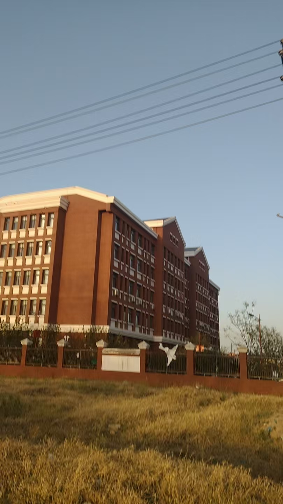
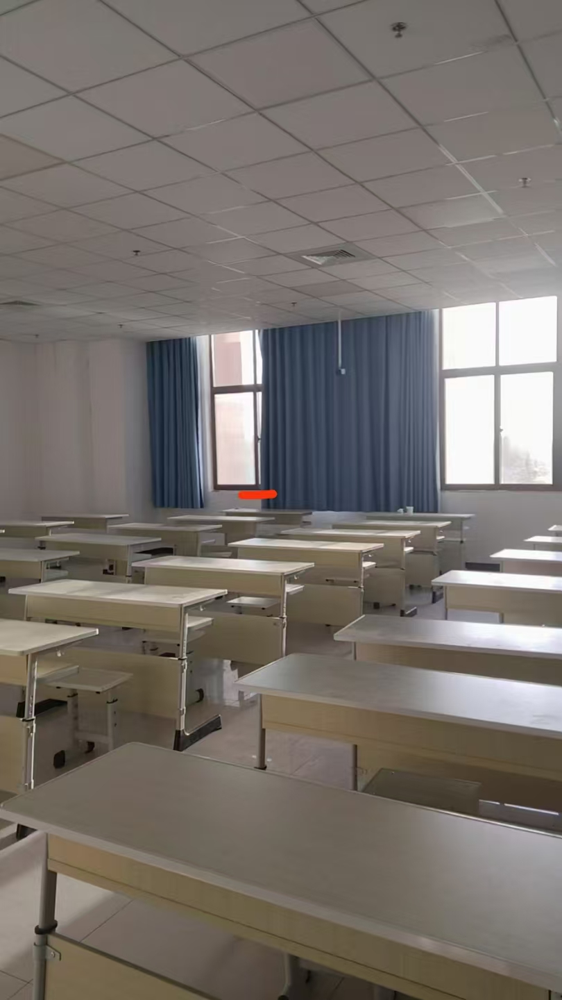
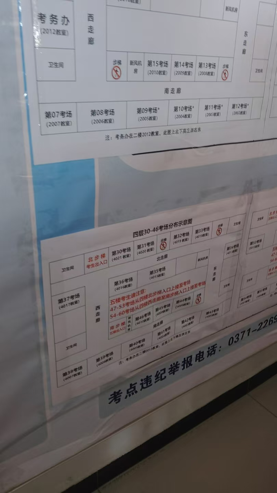

#### 考

今天（4.12）下午去考试了

看的出来，事业编考试有点低级，考官居然是学生

不过这个学校很漂亮。

在九大街。

河南对外经济贸易职业学院。

我了位置很好，38考场，四楼最西头最后一个位置，一个可以纵观所有人的位置，下图有，红色标记处。

位置极佳，只有我那个位置有阳光进入。

我身边的人，几乎都是尉氏是人，不是开封人，很少，想不到，我不用跑太远，在本地都能考，这无疑给我了很大的便利

很给我面子。

这几天风很大，考试的时候那个声音就像是吹风机对着铁皮吹，发出巨大的声音。

缺考的人很多，我数了，居然有11个，考试的人一共才20多个，我以为他们都很兴奋，想不到都和我一样，平静的很。

难的题，我都是蒙的。
我基本都是蒙和猜，涉及数学和推理的题，都是蒙的。

这个考试感觉不是很正规，或者说考务费贪了不少，学生监考，年纪比我还小，未成年小女生，小男生监考，长了很水灵。

那天风很大，公交坐了一个末班，很冷，女生多，冻得她们都抖索。然后去俺奶家过夜，第二天回家，这天很冷，风很大，像冬天一样。

（插曲：某人的认识的女友给他删了，他当时给我发聊天截图，我就说可贱这话说了，然后果不其然）

