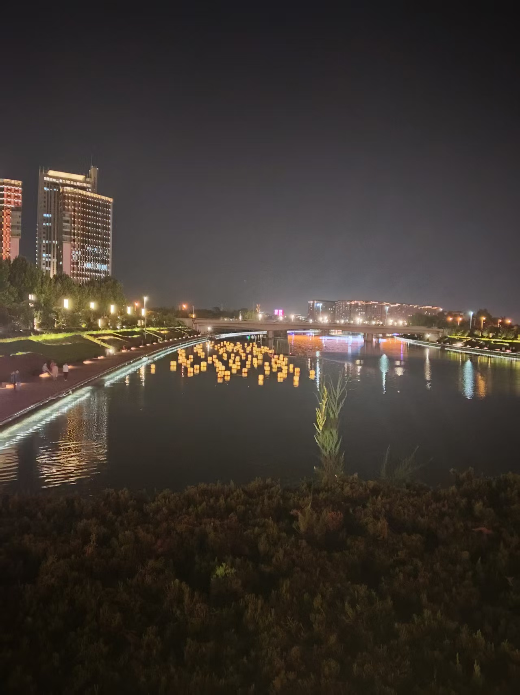
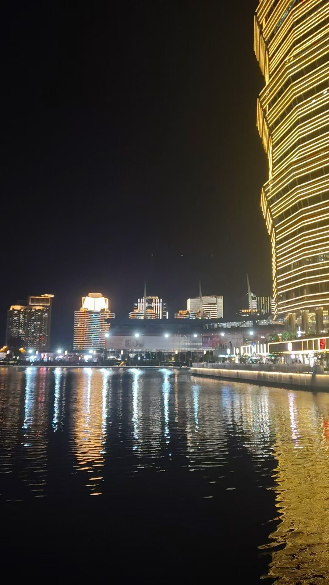
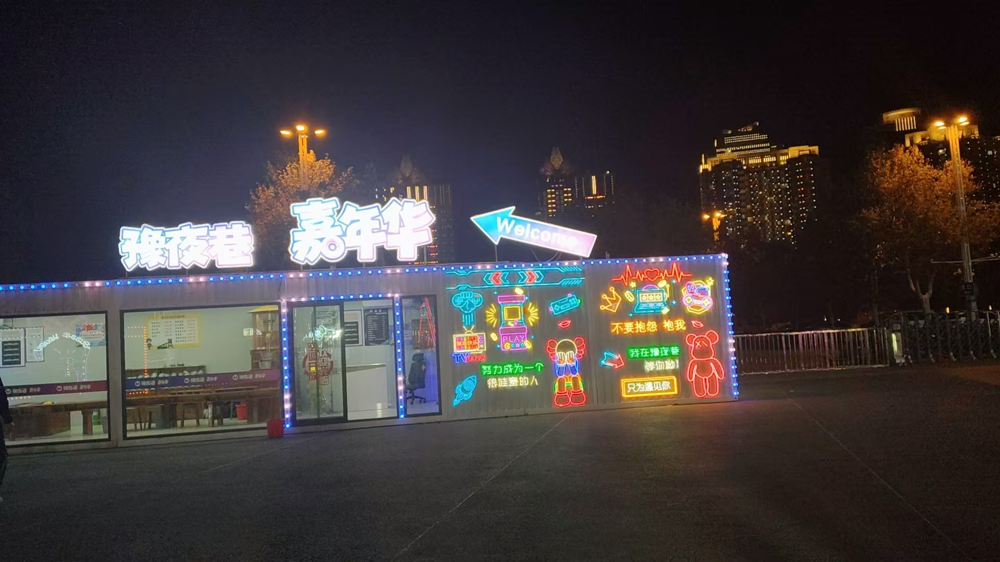
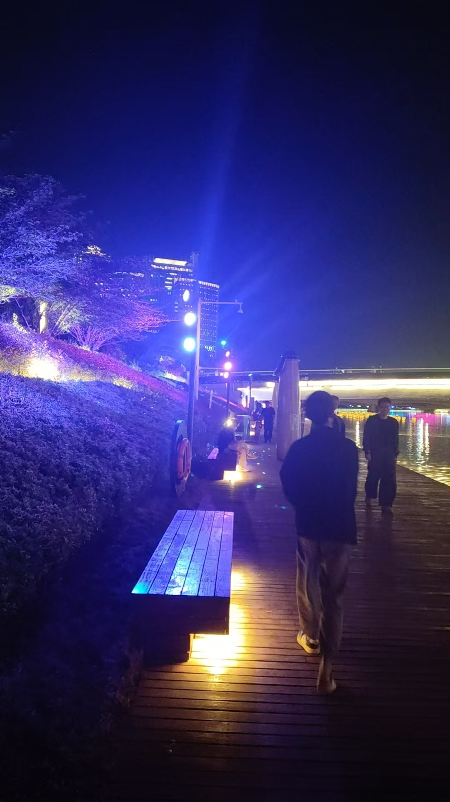
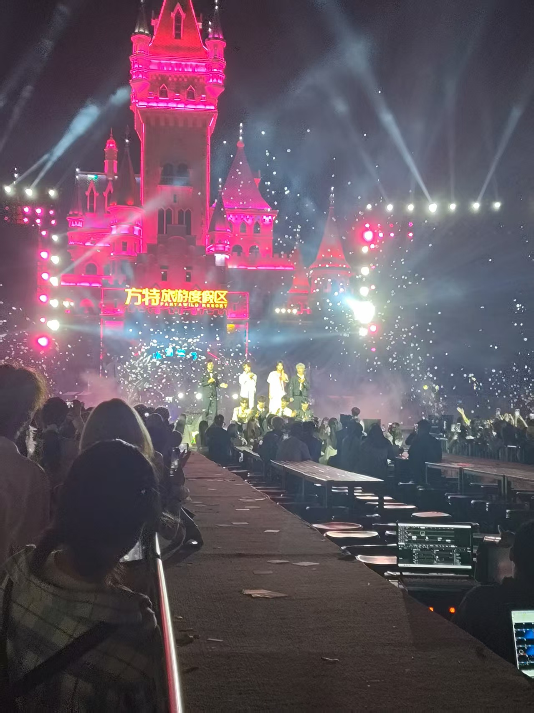
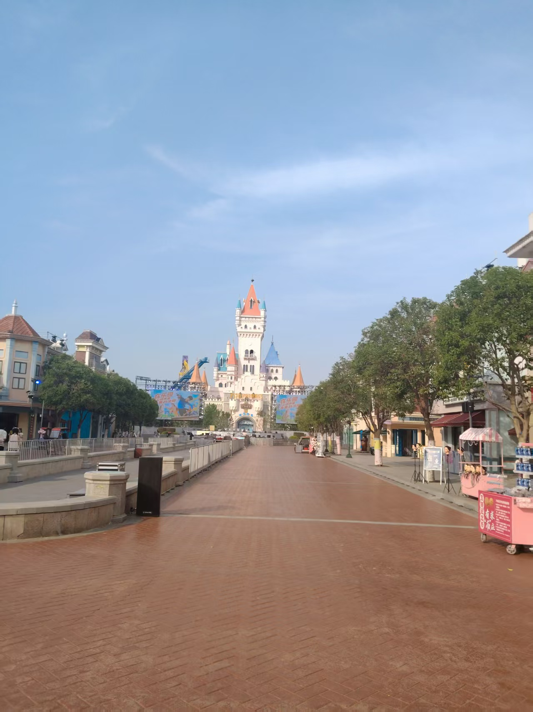
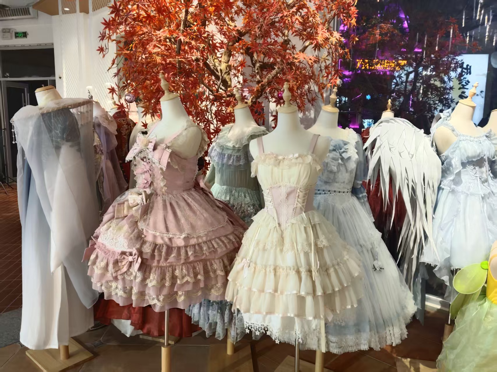
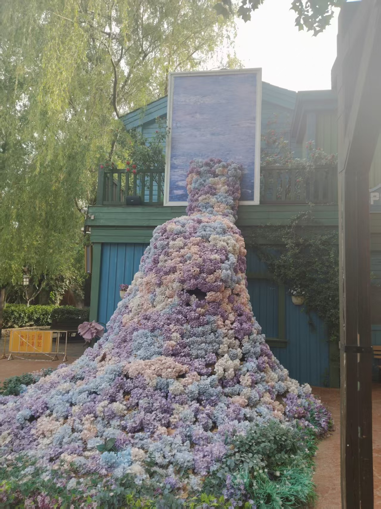
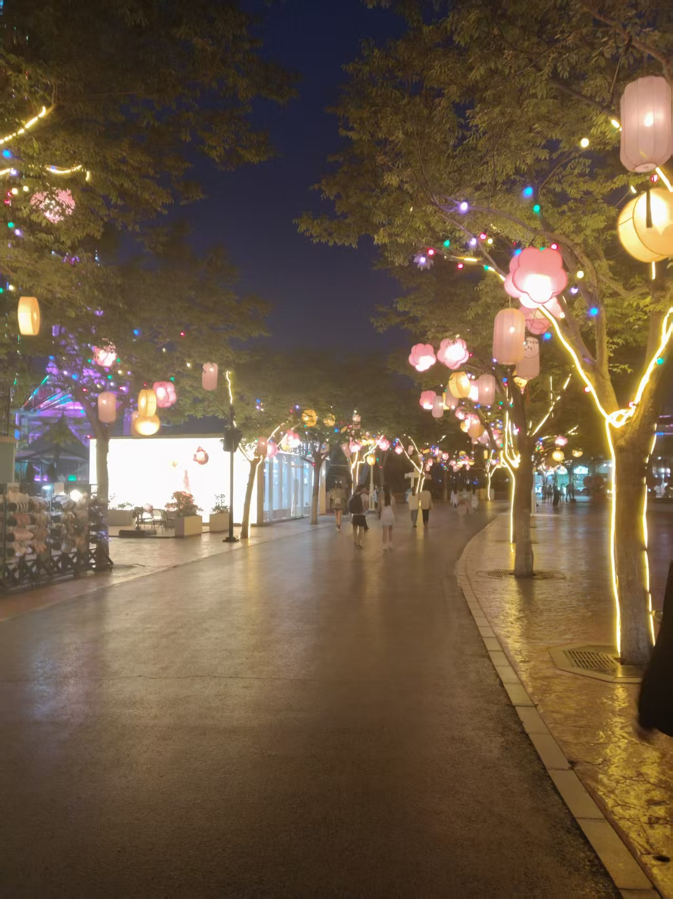
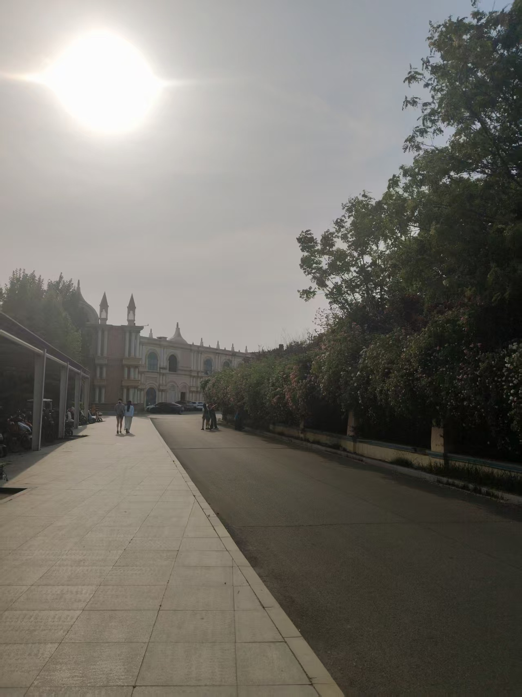

#### 玉米楼

强来之后，一直哔哔没有地方玩，他可想出来玩，虽然他才跟他女友出来玩，但是不知咋回事，他说自己可烦。(据说喜欢二次元的人得抑郁症的多，他身边有很多二次元周边)他一直聊什么他女友，想给女友负责之类的话，但是他的实力，远远不足。

4.24晚，去了郑州的玉米楼，确实很漂亮，尤其是夜景，风景很好，气势恢宏，风水很好，还有大量的湖边餐馆，确实很有味道，在湖边吃饭，这种美是现代化的，时尚的美，照片放几张吧。

### 方特

方特的真的值了，买的夜场票（4.25下午）。

这两天发生了很多事情，先从今天的事情说起，强这个蛋非得出来玩，他感觉生活没意思，准备去方特，但是我比较穷，买的夜场，便宜一些 全票280，夜场92才，这个价钱真不高，但凡你去过游乐场，中午嘛，强点了一个凉菜外卖，凉拌猪耳和一个酸萝卜片，都可难吃，而且不新鲜，那叫一个又贵有难吃 花了40，我点了一个鸭腿饭，11，外卖晚点了，我直接免单，很好吃，很香，好吃，爱吃。

那个外卖员叫张世龙 真是个好人，说他故意的，这样免单了，而且他自己也不扣钱。

我以为路上出事了。

然后就夜场出发去方特，方特的装修真的很好，如梦幻般都城堡，一模一样，通话的世界。

各种花，开在墙上，真的很漂亮。然后就进去了，进去就奔着最好玩的，最刺激的，但是人实在是多，第一个项目是唐古拉雪山，队很长，所以查了一下，是最不刺激的过山车，我没有太放心上，其实刺激，那个车的声音很大，再加上后边的女孩不听的尖叫，让人以为真的很快，而且它长时间的斜着爬坡，往漆黑的山洞里钻。增加了他的刺激，然后就是那个著名的暴风之眼，那个恐怖之处在于，把你放在高空之中体验失重，那个我实在不敢睁眼看了，我爬到最高之处后看了一眼，然后就是翻转了，我不想吐，就闭眼了，这个风暴之眼还有一个恐怖之处 就是排队时间长，你会亲眼看见那群人尖叫，第三者的角度看那个过山车的恐怖速度。

这都会增加心理压力，其实他的速度就是极快，惯性作用下令你的身体往前或者往后大幅倾斜。要是睁眼真有可能恐惧或者吐。

然后就是那个极速飞车，也是个过山车，我以为我不会害怕了，因为刚玩那个也是过山车，结果他更很，开到最高处往下冲，然后翻转，我跟之前一样，开到最高，然后闭眼，因为我真的怕吐，看见那种翻转的情况。

那个恐怖之处就是声音，发动机的雷鸣声，尖叫声，多次反转反转，真是不敢睁眼。

然后玩了就是那个高空秋千 我本来是有点怕，但是这个没有翻转，我就睁眼看了，俯瞰全景，景色不错，高空风很大很大 ，很凉快，很爽，估计我头发早乱完了。

然后就是那个著名的大摆锤，那个我童年听说过，是我的童年噩梦，当我真坐上去，比空中秋千低，没有嫩么害怕，几乎全程睁眼了。

那个就是那个把脑浆摇匀的空中飞舞了，那个是上下左右翻转，我本来被前几个都摇的脑浆有点晕了，这个是全程闭眼的，真怕吐。

结果晚上还有惊喜（大型野外蹦迪），就是五一表演的彩排，请了很多帅哥美女唱歌，好像tfboy的歌，tf有个梦幻城堡，和方特非常应景，当时有很多帅哥美女，真的，方特的帅哥美女真的漂亮，说是明星都不为过，再加上夜景五彩斑斓，灯光四射，仿佛梦幻，再加上他们一块唱歌，天上飘着彩带，很多情侣聚在一起，真的很美很美。

这个夜景真的令人震撼，最后开始发射泡泡，很多很多泡泡，在五彩光芒的折射出更多色彩，而且你戳破之后，他不是立即消失，而会变成一种类似烟的东西慢慢消失。

这个景象更加复合佛教中的，观一切有为法，如梦幻泡影，还有一种禅意美。

我真的很开心，好像穿越到了红楼梦那种奢华之中，（其实我还录了有很多视频，就不放这了），那个泡泡被戳破，更像是佛教中的禅意美，告诉我快乐的短暂和随时的寂灭。我很快乐，极尽视听享受，太满足了，还有很多人聚在一起的那种热闹轻松欢乐感，不仅让我快乐刺激，刺激的过山车从不敢坐再到战胜他，也有一种宗教中战胜内心的快感。战胜虚幻的快感。

这个地方极尽奢华，展现了人间的一切美好面，爱情，年轻，美景，美声，游戏，玩乐 豪华礼服，品牌美食，极尽奢华，豪华。

方特有一种禅意美，意境美，梦幻西方童话。

最后因为玩的太开心了，想买个纪念品，花十块买了一个方特的盲盒，我那个很丑，是一个3d的丑熊，有香味，类似于那种解压的玩具，他开的那个是一个熊二徽章。我当时不开心，现在想想，我那个是3d的，代表真实，他那个徽章是2d的，代表了虚幻，不真实，而且他买的饭很少好吃过，都是坑他的，反而我买的，都很便宜好吃，那货太沉迷虚假了。

而且回去的地铁坐过了，坐到圃田了，那个地铁灯装修很豪华，然后又坐才回家，可见那货的脑子被摇匀了，其实回来之后头都有点晕，真的摇匀了，有点刺激，网上说很多人直接尿裤，他们工作人员说，有游客一边吐，然后机器一直摇，跟下雨一样，他们的工作人员都很年轻，说话非常有意思，我说我吐了咋弄，她说你别给这个项目吐，去吐另外项目去。

我其实理解他们的想法，感觉方特好玩，所以想在这干，其实当他变成一个工作的时候，就不好玩了，快乐就是这样。

